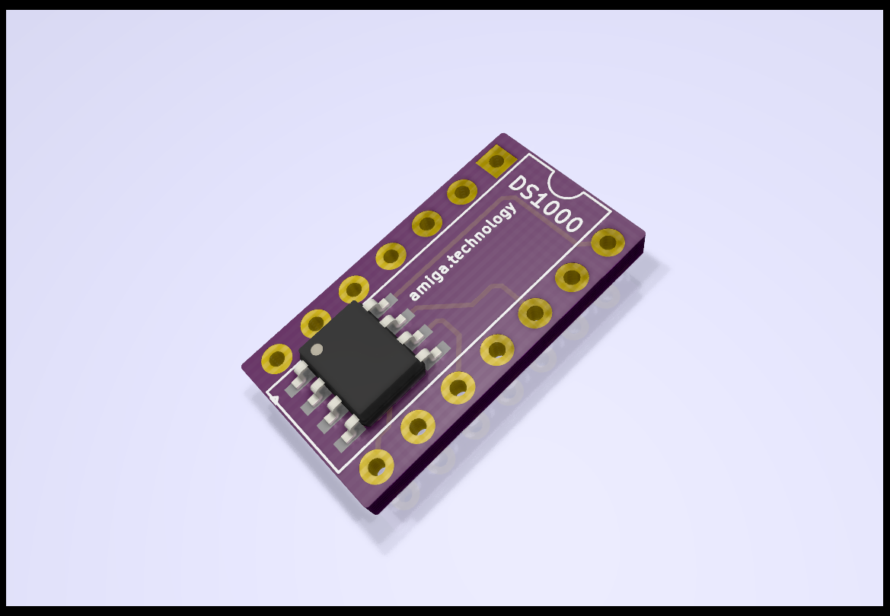

# DS1000 - Delay Line adapter

This project lets you use SMD delay lines on old iron like Amiga computers.

You can order this project on [PCBWay](https://www.pcbway.com/project/shareproject/DS1000_Delay_Line_Adapter.html) or [OSHPARK](https://oshpark.com/shared_projects/ab2PLkCQ)

