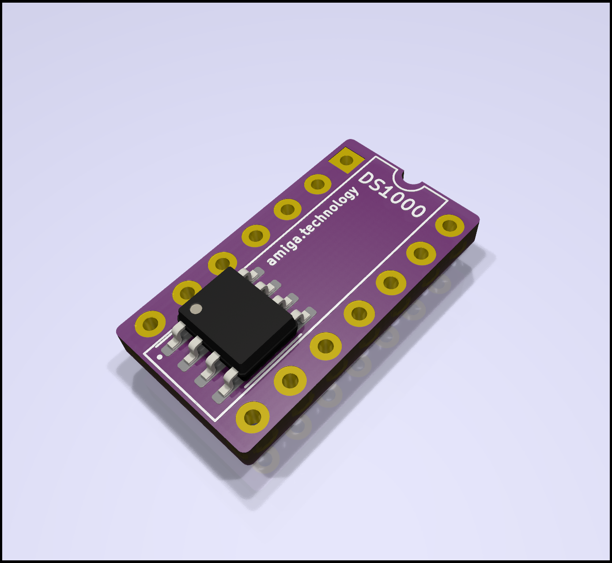

# DS1000 - Delay Line adapter

This project lets you use SMD delay lines on old iron like Amiga computers.

Newer (A3660) accelerator boards have a footprint for the smaller SOIC part on
the PCB already. But if you are rebuilding an Amiga 3640 accelerator, this will
let you use the much more readily available SOIC version of the DS1000 (e.g.
DS1100z)

You can order this project on [PCBWay](https://www.pcbway.com/project/shareproject/DS1000_Delay_Line_Adapter.html) or [OSHPARK](https://oshpark.com/shared_projects/ab2PLkCQ)

